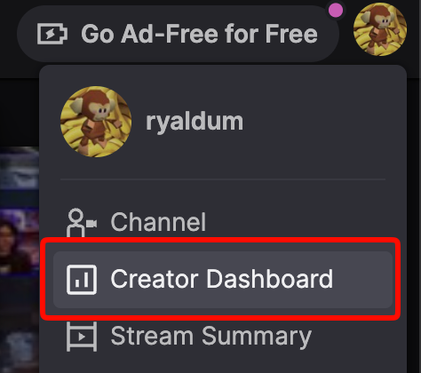
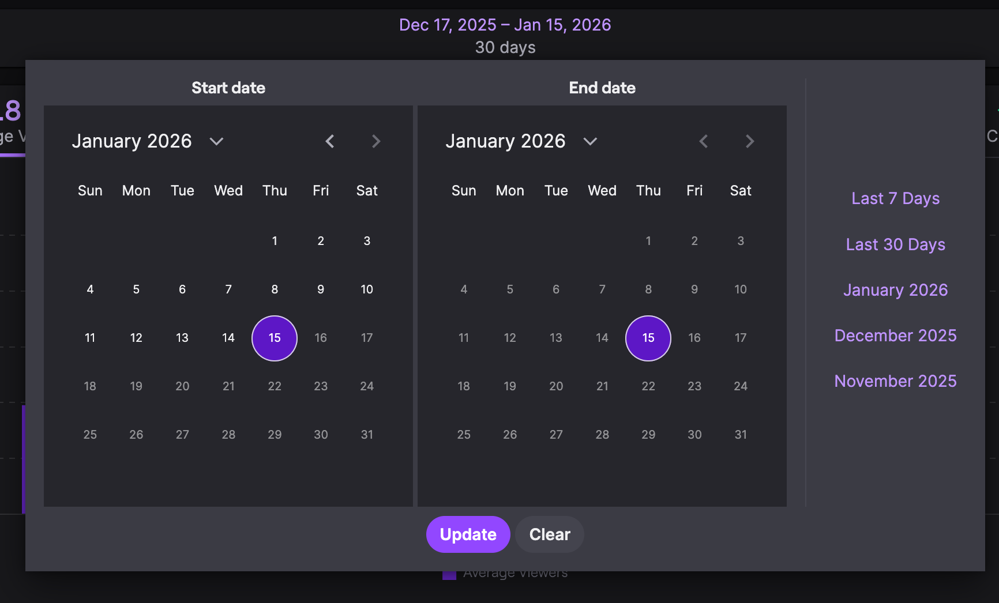
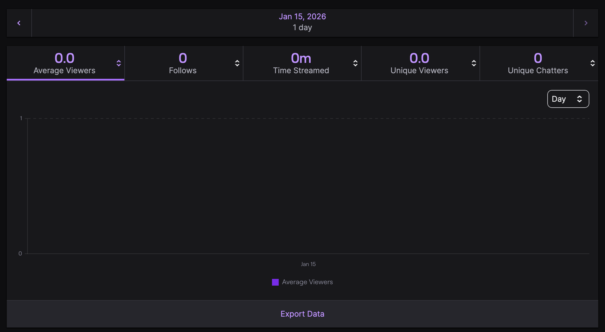

# Просмотр статистики стрима за день на Twitch
1. Зайдите на Twitch
2. Перейдите в в панель управления creator'а 

3. Слева перейдите в аналитику как скрине ниже 

4. Здесь нам необходимо выбрать период: слева начало, а справа конец. В нашем случае, мы хотим узнать статистику за день, поэтому нам необходимо выбрать один и тот же день и слева, и справа. Пример ниже... 

5. Нажимаем на "Update" и готово! Получается так... 

